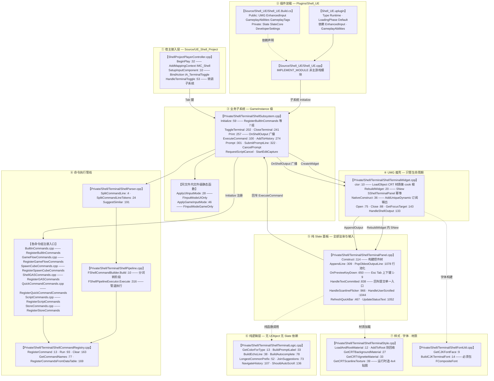
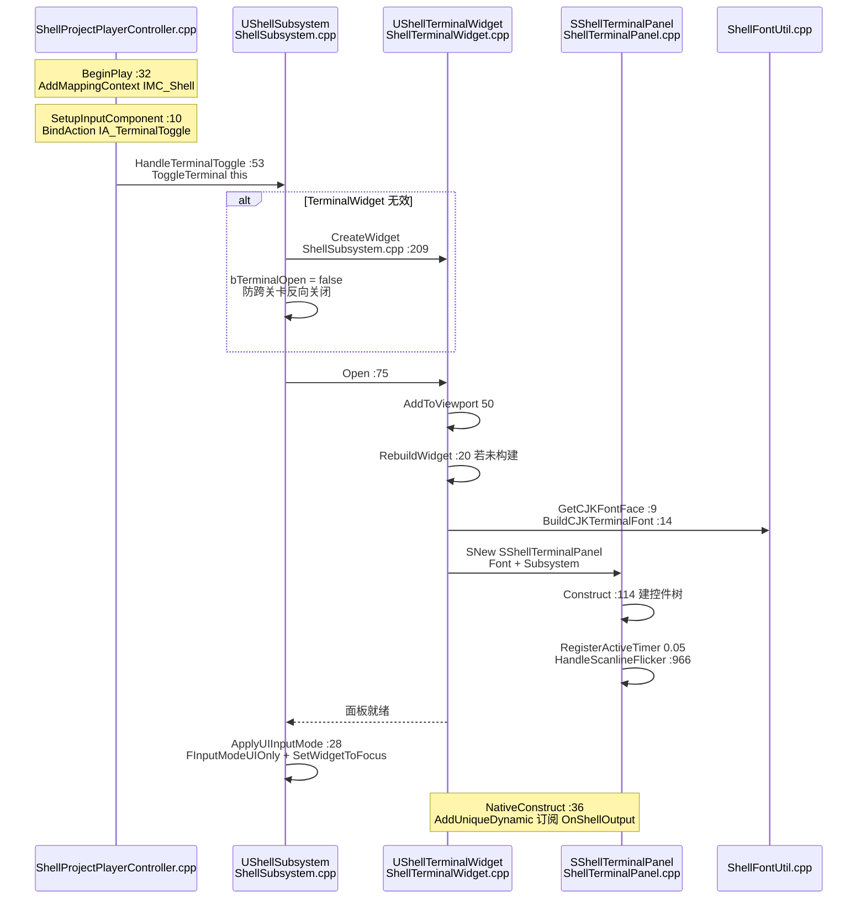
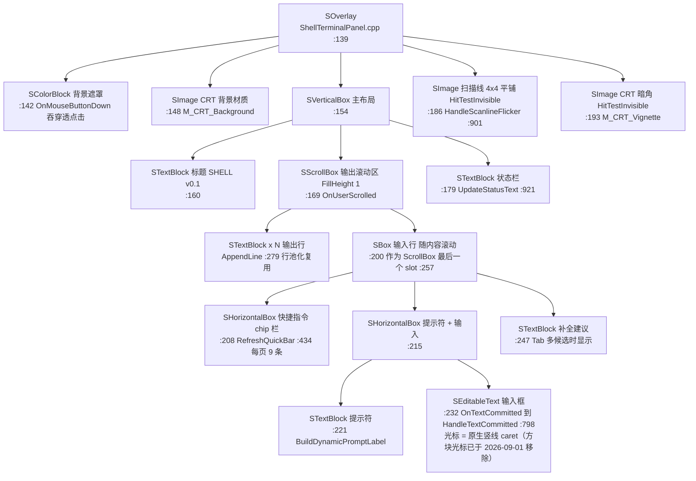

# Shell UI 架构图（带源码溯源标注）

> 所有节点均标注 **源文件名** 与 **函数名**（部分带行号），可直接跳转对照。
> 路径基准：`Plugins/Shell_UE/` 为插件根，`Source/UE_Shell_Project/` 为宿主游戏模块。

---

## 图 1 · 分层架构主图

### 关键调用链速记

| 流程 | 链路 |
| --- | --- |
| 打开终端 | `HandleTerminalToggle` → `UShellSubsystem::ToggleTerminal` → `CreateWidget` → `RebuildWidget` → `SNew(SShellTerminalPanel)` → `Open()→AddToViewport(50)` → `ApplyUIInputMode` |
| 输出回显 | `UShellSubsystem::Print` → `OnShellOutput.Broadcast` → `UShellTerminalWidget::HandleShellOutput` → `SShellTerminalPanel::AppendLine` → 行池化 `STextBlock` |
| 命令执行 | `HandleTextCommitted` → `UShellSubsystem::ExecuteCommand` → `FShellParser::SplitCommandLineTokens` → `FShellCommandBuilder::Build` → `FShellPipelineExecutor::Execute` → `FShellCommandRegistry::Run` |
| 程序化驱动 | `UShellTerminalWidget::SubmitLine` → `SShellTerminalPanel::SubmitLine` → 复用 `HandleTextCommitted`（与真实键入完全同路径） |

---

## 图 2 · 打开终端的调用时序

---

## 图 3 · Slate 控件树（标注构建位置）

> 注意：输入行是 `SScrollBox` 的**最后一个 slot**，不是独立固定行。
> 这正是放弃 `UListView` 虚拟化的原因——`SListView` 会销毁离屏行，输入行焦点与 IME 状态会丢失。

---

## 图 4 · 关键设计决策（为何这样实现）

```mermaid
flowchart LR
    subgraph D1["否决 UListView 虚拟化"]
        A1["doc/07 原推荐 UListView"] --> A2["SListView 销毁离屏行"]
        A2 --> A3["输入行也在滚动区内"]
        A3 --> A4["焦点与 IME 状态丢失"]
        A4 --> A5["改用 SScrollBox + 行池化<br/>PopOldestOutputLine :1078"]
    end

    subgraph D2["方块光标已移除（2026-09-01）"]
        B1["早期版本自制块状光标<br/>双层 SBox + SColorBlock"] --> B2["遮挡字形 与标准输入 UX 不符"]
        B2 --> B3["删除 CaretOffsetHost / CaretBlock<br/>与 UpdateCaret 等 5 个函数"]
        B3 --> B4["回退 SEditableText 原生竖线光标<br/>自带闪烁与失焦隐藏"]
    end

    subgraph D3["UE5.8 构建时机"]
        C1["引擎在 NativeConstruct 前<br/>就快照 RebuildWidget 的 Slate 内容"] --> C2["面板必须在 RebuildWidget :20 构建"]
        C2 --> C3["函数幂等 只建一次<br/>返回缓存 Panel"]
    end

    subgraph D4["CJK 字体陷阱"]
        E1["FSlateFontInfo UFontFace size"] --> E2["Cast 到 IFontProviderInterface 失败<br/>UFontFace 未实现该接口"]
        E2 --> E3["静默回退 LastResort 全是方块"]
        E3 --> E4["正解 FCompositeFont + FFontData<br/>BuildCJKTerminalFont :14"]
    end

    subgraph D5["跨关卡状态残留"]
        F1["控件随关卡旅行销毁"] --> F2["重建后必然是关闭态"]
        F2 --> F3["必须 bTerminalOpen = false<br/>ShellSubsystem.cpp :215"]
    end
```

---

## 溯源速查表

### 宿主模块 `Source/UE_Shell_Project/`

| 函数 | 文件:行 |
| --- | --- |
| `SetupInputComponent` | `ShellProjectPlayerController.cpp:10` |
| `BeginPlay` | `ShellProjectPlayerController.cpp:32` |
| `HandleTerminalToggle` | `ShellProjectPlayerController.cpp:53` |

### 子系统 `Plugins/Shell_UE/Source/Shell_UE/Private/Shell/Terminal/`

| 函数 | 文件:行 |
| --- | --- |
| `ApplyUIInputMode`（文件静态） | `ShellSubsystem.cpp:28` |
| `ApplyGameInputMode`（文件静态） | `ShellSubsystem.cpp:46` |
| `Initialize` | `ShellSubsystem.cpp:59` |
| `ExecuteCommand` | `ShellSubsystem.cpp:100` |
| `ToggleTerminal` | `ShellSubsystem.cpp:202` |
| `CloseTerminal` | `ShellSubsystem.cpp:241` |
| `Print` | `ShellSubsystem.cpp:257` |
| `AddToHistory` | `ShellSubsystem.cpp:274` |
| `Prompt` | `ShellSubsystem.cpp:301` |
| `SubmitPromptLine` | `ShellSubsystem.cpp:322` |

### UMG 瘦壳

| 函数 | 文件:行 |
| --- | --- |
| 构造函数（CRT 材质 cook 根） | `ShellTerminalWidget.cpp:10` |
| `RebuildWidget` | `ShellTerminalWidget.cpp:20` |
| `NativeConstruct` | `ShellTerminalWidget.cpp:36` |
| `NativeDestruct` | `ShellTerminalWidget.cpp:49` |
| `Open` | `ShellTerminalWidget.cpp:75` |
| `Close` | `ShellTerminalWidget.cpp:88` |
| `HandleShellOutput` | `ShellTerminalWidget.cpp:133` |
| `GetFocusTarget` | `ShellTerminalWidget.cpp:143` |

### Slate 面板（渲染核心，981 行）

| 函数 | 文件:行 |
| --- | --- |
| `Construct` | `ShellTerminalPanel.cpp:113` |
| `AppendLine` | `ShellTerminalPanel.cpp:279` |
| `ClearLines` | `ShellTerminalPanel.cpp:336` |
| `SetPrompt` | `ShellTerminalPanel.cpp:351` |
| `ClearPrompt` | `ShellTerminalPanel.cpp:382` |
| `SubmitLine` | `ShellTerminalPanel.cpp:409` |
| `SetInputLine` | `ShellTerminalPanel.cpp:421` |
| `RefreshQuickBar` | `ShellTerminalPanel.cpp:434` |
| `HandleQuickBarPageDelta` | `ShellTerminalPanel.cpp:530` |
| `HandleQuickCommandClicked` | `ShellTerminalPanel.cpp:548` |
| `HandleQuickCommandKey` | `ShellTerminalPanel.cpp:572` |
| `FocusInput` | `ShellTerminalPanel.cpp:593` |
| `GetFocusTarget` | `ShellTerminalPanel.cpp:611` |
| `OnPreviewKeyDown` | `ShellTerminalPanel.cpp:617` |
| `HandleTextCommitted` | `ShellTerminalPanel.cpp:798` |
| `HandleDeferredFocus` | `ShellTerminalPanel.cpp:885` |
| `HandleScanlineFlicker` | `ShellTerminalPanel.cpp:901` |
| `HandleUserScrolled` | `ShellTerminalPanel.cpp:913` |
| `UpdateStatusText` | `ShellTerminalPanel.cpp:921` |
| `PopOldestOutputLine` | `ShellTerminalPanel.cpp:947` |

### 纯逻辑 / 样式 / 字体

| 函数 | 文件:行 |
| --- | --- |
| `GetColorForType` | `ShellTerminalLogic.cpp:13` |
| `BuildPromptLabel` | `ShellTerminalLogic.cpp:33` |
| `BuildEchoLine` | `ShellTerminalLogic.cpp:38` |
| `LongestCommonPrefix` | `ShellTerminalLogic.cpp:52` |
| `JoinSuggestions` | `ShellTerminalLogic.cpp:73` |
| `BuildAutocomplete` | `ShellTerminalLogic.cpp:78` |
| `NavigateHistory` | `ShellTerminalLogic.cpp:107` |
| `ShouldAutoScroll` | `ShellTerminalLogic.cpp:136` |
| `LoadAndRootMaterial`（文件静态） | `ShellTerminalStyle.cpp:12` |
| `GetCRTBackgroundMaterial` | `ShellTerminalStyle.cpp:27` |
| `GetCRTVignetteMaterial` | `ShellTerminalStyle.cpp:33` |
| `GetCRTScanlineTexture` | `ShellTerminalStyle.cpp:39` |
| `GetCJKFontFace` | `ShellFontUtil.cpp:9` |
| `BuildCJKTerminalFont` | `ShellFontUtil.cpp:14` |

### 命令管线

| 函数 | 文件:行 |
| --- | --- |
| `FShellParser::SplitCommandLine` | `ShellParser.cpp:4` |
| `FShellParser::SplitCommandLineTokens` | `ShellParser.cpp:24` |
| `FShellParser::SuggestSimilar` | `ShellParser.cpp:191` |
| `FShellCommandBuilder::Build` | `ShellPipeline.cpp:10` |
| `FShellPipelineExecutor::Execute` | `ShellPipeline.cpp:316` |
| `FShellCommandRegistry::RegisterCommand` | `ShellCommandRegistry.cpp:13` |
| `FShellCommandRegistry::UnregisterCommand` | `ShellCommandRegistry.cpp:36` |
| `FShellCommandRegistry::GetCommandNames` | `ShellCommandRegistry.cpp:77` |
| `FShellCommandRegistry::Run` | `ShellCommandRegistry.cpp:93` |
| `FShellCommandRegistry::Clear` | `ShellCommandRegistry.cpp:163` |
| `FShellCommandRegistry::RegisterCommandsFromDataTable` | `ShellCommandRegistry.cpp:169` |

### 命令注册入口

| 注册函数 | 文件 |
| --- | --- |
| `RegisterBuiltInCommands` | `BuiltInCommands.h:16` |
| `RegisterGameFlowCommands` | `GameFlowCommands.h:14` |
| `RegisterSpawnCubeCommands` | `SpawnCubeCommands.h:14` |
| `RegisterGASCommands` | `ShellGASCommands.h:20` |
| `RegisterQuickCommandCommands` | `QuickCommandCommands.h:11` |
| `RegisterScriptCommands` | `ScriptCommands.h:11` |
| `RegisterStoreCommands` | `StoreCommands.h:11` |

---

## 建议阅读顺序（由浅入深）

1. `ShellProjectPlayerController.cpp` —— 看宿主怎么接线（30 行，最快建立全局观）
2. `ShellSubsystem.h` —— 看子系统对外暴露的全部能力
3. `ShellTerminalWidget.cpp` —— 看 UMG 瘦壳如何只做生命周期（153 行）
4. `ShellTerminalLogic.h` —— 看纯函数层，无引擎依赖，最容易读懂
5. `ShellTerminalPanel.cpp::Construct` —— 看 Slate 控件树怎么搭（:114 起）
6. `ShellTerminalPanel.cpp::OnPreviewKeyDown` 与 `HandleTextCommitted` —— 看输入与提交
7. `ShellPipeline.cpp` —— 看命令如何被分词、组装、执行
